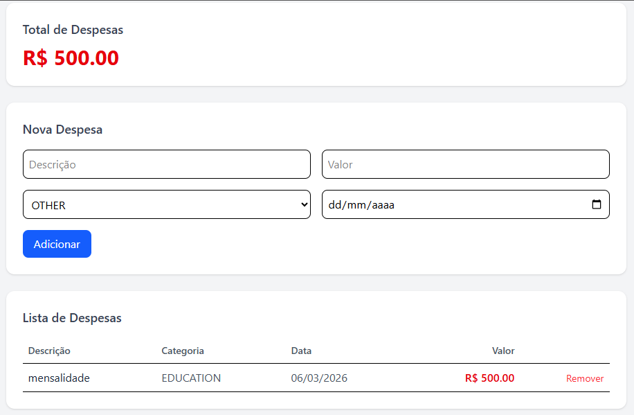

# 💰 Controle Financeiro

Aplicação de controle financeiro desenvolvida com React, TypeScript e Vite.

## 🚀 Funcionalidades

- Cadastro de despesas
- Listagem de despesas
- Remoção de despesas
- Cálculo automático do total
- Persistência com localStorage

## 🧠 Arquitetura

O projeto foi estruturado em camadas:

- **domain** → modelos e enums
- **services** → persistência de dados
- **context** → estado global (Context API)
- **components** → interface
- **pages** → composição das telas

## 🛠️ Tecnologias

- React
- TypeScript
- Vite
- TailwindCSS

## ▶️ Como rodar

```bash
npm install
npm run dev
```

## 📸 Preview


